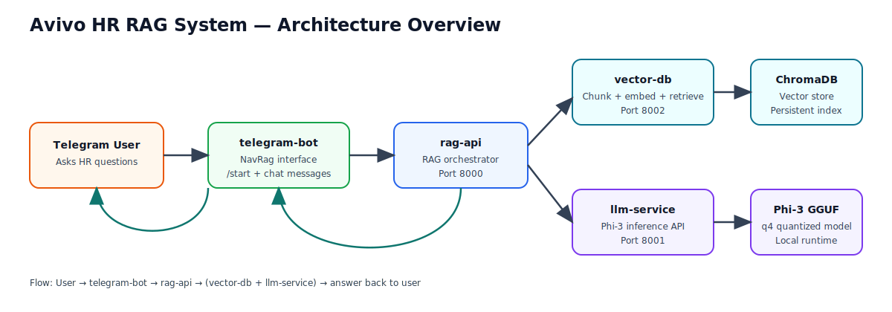
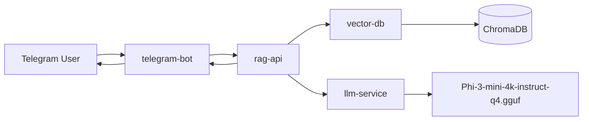

# Avivo RAG System Architecture

This document defines the technical architecture of the Avivo HR RAG system and explains how each component works together to answer Employee Handbook questions.

- Handbook source PDF: https://resources.workable.com/wp-content/uploads/2017/09/Employee-Handbook.pdf
- Inference model: `Phi-3-mini-4k-instruct-q4.gguf`
- Vector store: ChromaDB
- APIs: FastAPI microservices
- Chat interface: Telegram bot (NavRag)



## 1) High-Level Architecture



## 2) Component Breakdown

### A. `vector-db` service (Port 8002)

Purpose:
- Ingest and chunk handbook documents.
- Convert chunks to embeddings.
- Persist vectors in ChromaDB.
- Retrieve top-k semantically similar chunks for a query.

Key internals:
- Chunking: hybrid chunking pipeline.
- Embeddings: sentence-transformers model (`all-MiniLM-L6-v2`).
- Persistence: local Chroma DB directory.

API endpoints:
- `GET /health`: service/index status.
- `POST /index`: load docs, chunk, vectorize, persist.
- `POST /query`: retrieve relevant chunks.

### B. `llm-service` service (Port 8001)

Purpose:
- Load and serve the local GGUF model for answer generation.
- Provide generation API for downstream RAG orchestration.

Key internals:
- Runtime: `llama-cpp-python`.
- Model file: `Phi-3-mini-4k-instruct-q4.gguf`.
- Model lifecycle: downloaded once, reused from local cache (`models/`).

API endpoints:
- `GET /` and `GET /health`: service and model status.
- `POST /ask`: main text generation endpoint.
- `POST /generate`: backward-compatible alias.

### C. `rag-api` service (Port 8000)

Purpose:
- Orchestrate complete RAG flow.
- Fetch top-k context from `vector-db`.
- Build HR prompt with handbook context.
- Request final answer from `llm-service`.

Key internals:
- Dependency URLs configurable with env vars:
  - `VECTOR_DB_URL`
  - `LLM_SERVICE_URL`
- Includes answer normalization and HR-focused response behavior.

API endpoints:
- `GET /health`
- `POST /retrieve`
- `POST /ask-rag`
- `POST /ask` (alias)

### D. `telegram-bot` (NavRag)

Purpose:
- User-facing chat entry point on Telegram.
- Accept messages and `/start` command.
- Forward user question + user_id to `rag-api`.
- Return RAG answer back to the same chat.

Key runtime inputs:
- `BOT_TOKEN`
- `RAG_API_URL` (example: `http://127.0.0.1:8000/ask`)

## 3) End-to-End Data Flow

1. User asks HR question in Telegram.
2. `telegram-bot` forwards payload to `rag-api`.
3. `rag-api` calls `vector-db /query` for top-k relevant chunks.
4. `vector-db` searches ChromaDB and returns matched context.
5. `rag-api` composes prompt using handbook context.
6. `rag-api` calls `llm-service /ask`.
7. `llm-service` runs inference using Phi-3 GGUF.
8. `rag-api` returns final answer to `telegram-bot`.
9. Telegram bot sends answer back to the user.

## 4) Why ChromaDB + Vectorization + Phi-3

- ChromaDB provides lightweight local semantic retrieval and persistence.
- Vectorization enables meaning-based search instead of keyword-only matching.
- RAG grounds responses in handbook evidence, reducing hallucinations.
- Phi-3-mini-4k-instruct-q4.gguf gives efficient local inference for API usage.

## 5) Startup Commands (Jupyter User Reference)

The following reflects your Jupyter-style startup sequence.

### 5.1 Start vector-db first

```bash
cd /home/jupyter/avivo/rag-system/services/vector-db/vector-db-service
source venv/bin/activate
uvicorn app.api:app --host 127.0.0.1 --port 8002
```

### 5.2 Start llm-service second

```bash
cd /home/jupyter/avivo/rag-system/services/llm-service
uvicorn app.api:app --host 127.0.0.1 --port 8001
```

### 5.3 Start rag-api third

```bash
cd /home/jupyter/avivo/rag-system/services/rag-api
uvicorn app.api:app --host 127.0.0.1 --port 8000
```

### 5.4 Start telegram-bot last

```bash
cd /home/jupyter/avivo/rag-system/services/telegram-bot/app
python bot.py
```

Note: For the bot command, `cd` should target the `app` directory (not `bot.py` file path).

## 6) Operational Notes

- Index documents once before asking RAG questions (`vector-db /index`).
- Keep all services running in separate terminals.
- Verify dependency URLs from `rag-api` health endpoint.
- If retrieval fails, confirm `vector-db` is indexed and reachable.
- If generation fails, confirm model is loaded in `llm-service`.
